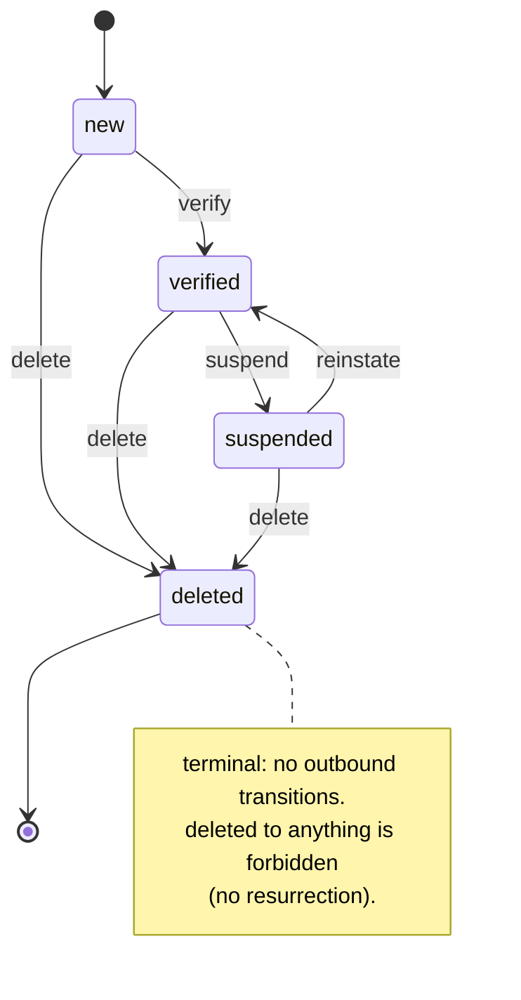
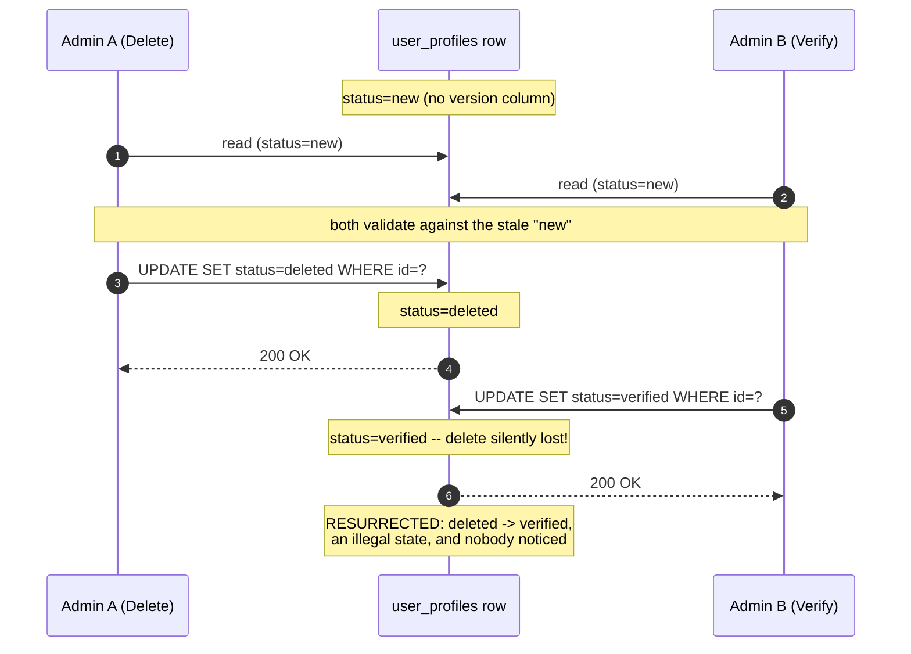
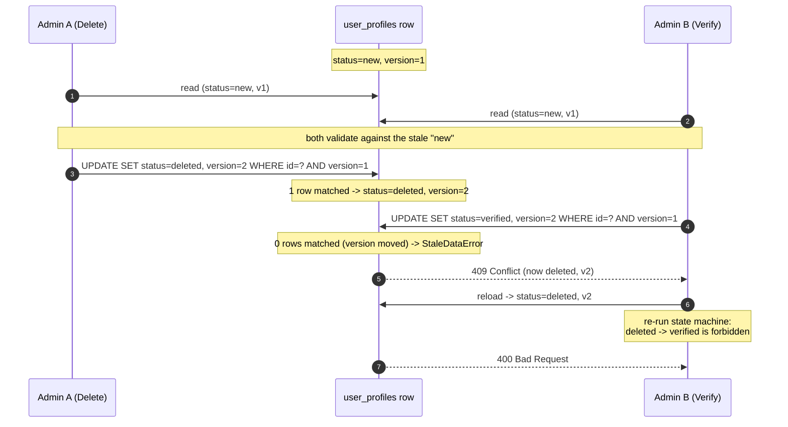

# Pattern 4 — Optimistic Locking: Tech Demo Plan

**Scenario:** Concurrent **lifecycle transitions** on a `UserProfile` — a state machine with statuses `new → verified → suspended → deleted` — protected so that an illegal or stale transition (above all, **resurrecting a deleted profile**) can never slip through.
**Audience:** Group of programmers (mixed familiarity with SQLAlchemy / concurrency)
**Duration:** ~30–45 minutes (standard session)
**Format:** Live, visual demo driven by **two browser tabs** acting as two admins operating on the same profile. One wins, the other receives an `HTTP 409 Conflict`, reloads against fresh state, re-runs the state machine, and discovers its transition is now illegal (`HTTP 400`).
**Stack:** FastAPI + SQLAlchemy + **PostgreSQL** (already the live DB per `.env` / docker-compose).
**Deliverable status:** Proposal only — no application code changed yet. Section 4 specifies the enhancement to build before the demo.

---

## 1. The story we want to tell

Two admins act on the same user profile at the same time. The profile is in state `new`. Admin A clicks **Delete**; Admin B clicks **Verify**. Both read `new`, both validate their move against `new` (`new→deleted` is legal, `new→verified` is legal), and both proceed. The only safe outcome is that exactly one transition takes effect and the other is forced to re-evaluate. Yet a naive "read the row, set the new status, save" implementation lands on whichever write happens to commit last — and if Verify lands after Delete, you have just **resurrected a deleted account**. That is the **lost update** problem, and here it produces a state that *no legal sequence of transitions could ever reach*: `deleted → verified` is explicitly forbidden, but the race walked straight into it.

Optimistic locking fixes it without locking anyone out. Everyone reads freely; the collision is detected **at commit time** via a `version` number. The first transition to commit bumps the version; the second transition's update no longer matches the version it read, the `UPDATE` touches zero rows, and SQLAlchemy raises `StaleDataError`. We turn that into a clean `409 Conflict`, the client reloads the *current* status, re-runs the state machine against it — and now sees the profile is `deleted`, so `deleted→verified` is rejected with a `400`. The illegal resurrection is blocked twice over: once by the version check, once by the re-validated business rule.

The reason this scenario beats "two people editing a field" is twofold. First, the new value is **gated by the old value** (a read-validate-write): the legality of `verify` depends entirely on the *current* status, so last-write-wins is provably *wrong*, not merely impolite. Second, there is real **business logic between the read and the write** — a transition-table check plus per-transition side effects (provisioning on verify, cascade soft-delete and session revocation on delete) — that must run against the truly-current state. That logic is exactly what optimistic locking protects, and it's why "just do it in one SQL statement" (the obvious objection) doesn't scale. See Section 9.

**The state machine.** Four states, with `deleted` terminal — that terminality is the invariant the whole demo defends:



**The race without optimistic locking (the bug we start from).** No `version` column, blind `setattr` + commit. Both writes succeed, the later one wins, and the delete is silently lost — the account is resurrected into an illegal state with no error raised anywhere:



**The race with optimistic locking (the fix).** Both admins read `new`, both validate legally, but only one write can win — the version check turns the lost update into a 409, after which the reload re-runs the machine and correctly refuses with a 400:



Without the version guard, step B's write would have silently overwritten `deleted` with `verified` — the resurrection. With it, B is told to reload, and the reloaded state makes the illegality obvious.

---

## 2. Why a two-tab visual demo is the right vehicle

Concurrency bugs are abstract on a slide and invisible in a single terminal. Two side-by-side browser tabs map directly onto "two admins." The audience watches both status badges and version numbers, sees one transition commit, sees the other turn red with a conflict, then watches the recovery surface the *real* business rule: you cannot un-delete. It's the difference between being *told* a race exists and *watching* one get caught — and watching a forbidden state get prevented.

The UI stays deliberately tiny (one static HTML page served by FastAPI, no build step) so it teaches the pattern instead of distracting from it.

---

## 3. Current state of the app (the "before")

The vulnerability is already implied by the codebase, which makes the opening honest and concrete:

- **`UserProfile` has no lifecycle state and no concurrency control.** `app/models/user_profile.py` defines `email`, `username`, `full_name`, an `is_active` boolean, and audit timestamps — but **no `status` column**, **no `version` column**, and **no `__mapper_args__`**. Lifecycle today is a single boolean flag, which can't express `new` vs `verified` vs `suspended` vs `deleted`, let alone forbid `deleted → anything`.
- **The existing update is a blind overwrite.** `update_user_profile` in `app/routers/user_profiles.py` does `setattr(user_profile, key, value)` over `model_dump(exclude_unset=True)` then `db.commit()` — pure last-write-wins, no version check, no transition validation. The moment we introduce a `status` field, two concurrent updates clobber each other and a deleted profile can be silently flipped back to verified. This is the "before" we demo first.
- **No state-machine concept yet.** Status is never modeled, so there is no transition table, no terminal state, no side effects. We add those.
- **PostgreSQL is live.** `.env` → `postgresql://...:5432/pythontrio_live`; `docker-compose.yml` runs `postgres:16-alpine`. The demo runs on a real RDBMS.
- **House conventions to mirror:** services build work and let the caller own the commit boundary (`app/services/onboarding_service.py` flushes and returns an uncommitted entity); routers translate errors to HTTP (`app/routers/*`). Tests use pytest under `tests/unit`, `tests/integration`, `tests/scripts` with a shared `conftest.py`.

Opening move: show `update_user_profile`'s blind `setattr`, sketch a `status` field on top of it, ask the room what happens when a *delete* and a *verify* hit it concurrently, and let them realize a deleted account can come back to life.

---

## 4. How to enhance the app to build this

Six focused additions, all relative to `python_trio/`. Each mirrors existing conventions, and the feature ships exactly as any other production endpoint would — no demo prefixes, no feature flags, no timing hooks. The fact that it makes a great teaching subject is incidental to it being a correct, real feature.

### 4.1 Add a `status` state machine to `UserProfile`
In `app/models/user_profile.py`, introduce an enum and a column. Four states, one of them terminal:

```python
import enum
from sqlalchemy import Enum as SAEnum

class ProfileStatus(str, enum.Enum):
    NEW = "new"
    VERIFIED = "verified"
    SUSPENDED = "suspended"
    DELETED = "deleted"          # terminal — no outbound transitions

# on UserProfile:
status: Mapped[ProfileStatus] = mapped_column(
    SAEnum(ProfileStatus, name="profile_status"),
    nullable=False,
    default=ProfileStatus.NEW,
    server_default=ProfileStatus.NEW.value,
)
```

The legal transition table lives in one place (in the service, Section 4.3):

```python
ALLOWED_TRANSITIONS: dict[ProfileStatus, set[ProfileStatus]] = {
    ProfileStatus.NEW:       {ProfileStatus.VERIFIED, ProfileStatus.DELETED},
    ProfileStatus.VERIFIED:  {ProfileStatus.SUSPENDED, ProfileStatus.DELETED},
    ProfileStatus.SUSPENDED: {ProfileStatus.VERIFIED, ProfileStatus.DELETED},
    ProfileStatus.DELETED:   set(),    # terminal: nothing is reachable from deleted
}
```

Note that **`deleted` is reachable from three different states** (`new`, `verified`, `suspended`). Hold that thought — it's the crux of Section 9.

### 4.2 Add a `version` column to `UserProfile`
In the same model:

```python
version: Mapped[int] = mapped_column(Integer, nullable=False, default=1)

__mapper_args__ = {"version_id_col": version}
```

This single `__mapper_args__` line is the heart of the demo. Every `UPDATE` SQLAlchemy emits for a profile now carries `... WHERE id = :id AND version = :expected` and auto-increments `version`. If zero rows match, SQLAlchemy raises `StaleDataError`. **No hand-written version checks anywhere** — the ORM and DB enforce it, on *every* write path, including the plain profile edit that changes email/username.

### 4.3 Alembic migration for the new columns
Add both columns with server defaults so existing rows backfill cleanly (`status='new'`, `version=1`):

```python
def upgrade():
    profile_status = sa.Enum('new', 'verified', 'suspended', 'deleted',
                             name='profile_status')
    profile_status.create(op.get_bind(), checkfirst=True)
    op.add_column('user_profiles',
        sa.Column('status', profile_status, nullable=False, server_default='new'))
    op.add_column('user_profiles',
        sa.Column('version', sa.Integer(), nullable=False, server_default='1'))
```

Showing the migration makes clear this is a real schema change, run with `alembic upgrade head`. (Mention the matching `downgrade()` that drops both columns and the enum type.)

### 4.4 A transition service with the state-machine rules and side effects
New `app/services/profile_lifecycle_service.py`, in the existing "service builds, caller commits" style (mirroring `OnboardingService`). One method does the read-validate-write that optimistic locking protects:

```python
def transition(self, profile_id: int, target: ProfileStatus) -> UserProfile:
    profile = self.db.get(UserProfile, profile_id)        # reads current status + version
    if profile is None:
        raise ProfileNotFound(profile_id)
    if target not in ALLOWED_TRANSITIONS[profile.status]:
        raise IllegalTransitionError(                     # business rule, incl. deleted→*
            profile_id, profile.status, target)
    self._run_side_effects(profile, target)               # provision / suspend / cascade
    profile.status = target
    # caller commits; version_id_col enforces expected_version at flush
    return profile
```

The per-transition side effects (`_run_side_effects`) are what make this more than a column flip and live firmly in Python against current state:

- **verify** (`new→verified`): provision the user's starter portfolio / send welcome mail.
- **suspend** (`verified→suspended`): revoke active sessions, freeze the account.
- **reinstate** (`suspended→verified`): re-enable access.
- **delete** (`*→deleted`): cascade soft-delete the user's portfolios + holdings, write an audit record, revoke sessions.

Add an exception type alongside the parent plan's exception design (`app/exceptions/transaction.py`, `TransactionError` base), e.g. `IllegalTransitionError(TransactionError)` carrying `profile_id`, `current_status`, `requested_status`.

### 4.5 A conflict-aware endpoint
Add `POST /user-profiles/{id}/transition` to the existing `app/routers/user_profiles.py` (the router is already mounted under `prefix="/user-profiles"` in `app/main.py`). If the lifecycle surface grows enough to warrant its own module under SRP, split it into `app/routers/user_profile_transitions.py` (same `/user-profiles` prefix, registered in `app/main.py`); for now it sits beside the existing CRUD handlers. Request body: `{ "target": "verified"|"suspended"|"deleted", "expected_version": <int> }`. Behaviour:

- Call `profile_lifecycle_service.transition(...)`, then `db.commit()`.
- On `sqlalchemy.orm.exc.StaleDataError` → roll back, return **`409 Conflict`** with the current status/version in the body, a **`Retry-After: 1`** header, and a "reload and re-evaluate your action" message.
- On `IllegalTransitionError` → **`400 Bad Request`** ("cannot transition `deleted` → `verified`"). This is a *different* failure from the concurrency conflict, and surfacing both — sometimes on the *same* button — teaches the distinction.
- On success → return the profile with its **new** status and version.

The endpoint takes no timing, delay, or testing parameters; its only inputs are the target status and the client's `expected_version`, exactly as a real optimistic-lock-aware API requires.

### 4.6 An admin management UI for profile lifecycle
Serve a self-contained admin page at `GET /user-profiles/admin` (vanilla JS, no framework, no build step) — a legitimate operations tool for support/admin staff to inspect a profile's lifecycle and drive transitions. For a chosen profile it shows:

- Email / username.
- Current **status badge** (color-coded: new=grey, verified=green, suspended=amber, deleted=black) and a prominent **version badge** (e.g. `v3`).
- Action buttons whose enablement reflects the *cached* state: **Verify**, **Suspend**, **Reinstate**, **Delete**.
- A color-coded **status banner** and a small **event log** of actions taken in this session.

Flow the page implements:

1. On load, `GET` the profile and cache `status` + `expected_version` locally.
2. On any action, `POST .../transition` with the target status and the cached `expected_version`.
3. On `200`: banner **green**, update displayed status + version, log "VERIFY → verified (v2)".
4. On `409`: banner **red**, "Someone changed this profile while you were deciding — now `deleted` (vN)," plus a **Reload** button that re-fetches and refreshes the cached version.
5. On `400`: banner **amber**, show the illegal-transition message ("cannot go `deleted → verified`").

Note that this is correct UX for an optimistic-lock-aware interface, not a demo shortcut: the UI intentionally caches `expected_version` locally and submits it unchanged until the admin explicitly reloads — that cached version *is* the compare-and-swap token, and holding it is precisely how the client lets the server detect that the row moved underneath it. Two admins opening the page on the same profile is the ordinary multi-operator case the optimistic lock exists to handle; because each tab holds its own cached `expected_version`, a stale tab's action deterministically surfaces a `409` without any artificial timing.

---

## 5. Session agenda (~30–45 min)

| # | Segment | Time | What happens |
|---|---------|------|--------------|
| 1 | Hook: raising the dead | 4 min | Show `update_user_profile`'s blind `setattr`. Sketch a `status` field. Pose delete + verify from `new`. Ask the room for the result; let them spot that a deleted account comes back. |
| 2 | Concept | 5 min | Optimistic vs. pessimistic in one line each. Sequence diagram: two readers, one winner. "Detect, don't prevent." |
| 3 | The mechanism | 6 min | The 2-line change: `version` column + `version_id_col`. The generated `WHERE version = :expected` + auto-increment. No hand-written checks. |
| 4 | **Live demo** | 10 min | Two-tab delete/verify collision → 409 → reload → 400 forbidden; then the suspended-state extensibility lap (run-sheet in Section 6). |
| 5 | Under the hood | 6 min | Echoed SQL showing `WHERE ... AND version = ?`; the `StaleDataError`; router mapping to `409` + `Retry-After`; contrast with the `400` illegal-transition path. |
| 6 | Retry & UX strategy | 4 min | Reload-and-re-evaluate, exponential backoff + jitter, when a 409 should be invisible vs. surfaced, why the retry here legitimately becomes a 400. |
| 7 | Trade-offs & "why not just SQL?" | 4 min | The conditional-`UPDATE` objection and why it rots as the machine grows (Section 9); optimistic vs. pessimistic (forward-ref Pattern 6); the high-read/low-write sweet spot. |
| 8 | Q&A | 3–6 min | Section 8. |

---

## 6. Live demo run-sheet (the 10-minute core)

**Pre-flight (off-screen):** `docker compose up -d`; `alembic upgrade head` (status + version columns present); seed a profile (e.g. `ada@example.com`) at **status `new`, version 1**. App running. Open `GET /user-profiles/admin?profile=<id>` in **two tabs** side by side; confirm both show `new`, `v1`. Font size up.

**Act 1 — Baseline (≈2 min)**
1. Both tabs show status `new` and the same version badge `v1`.
2. **Tab A: Delete** → black badge, status `deleted`, version ticks to `v2`. (Out loud: this also cascaded the user's portfolios and wrote an audit row — not a bare column flip.)
3. Note **Tab B still shows `new` / `v1`** — it never learned about the delete. "Tab B is now stale. Watch."

**Act 2 — The collision (≈3 min)**
4. **Tab B: Verify** (still sending `expected_version=1`).
5. Tab B banner goes **red: 409 Conflict** — "profile changed to `deleted` (v2) while you were deciding."
6. Drive it home: "Without optimistic locking, Tab B would have written `verified` over `deleted` — silently **resurrecting an account we just deleted**. `deleted → verified` is forbidden, yet the race walked right into it. The version check stopped it."

**Act 3 — Recovery surfaces the real rule (≈2 min)**
7. Tab B: click **Reload** → sees status `deleted`, `v2`.
8. Re-click **Verify** → **amber 400**, "cannot transition `deleted → verified`." "The retry didn't just succeed — it re-ran the state machine on fresh state and correctly refused. 409 protected us from the race; 400 protected us from the illegal move."

**Act 4 — Extensibility lap + under the hood (≈3 min)**
9. On a *second* seeded profile (start `verified`, `v1`): **Suspend** → amber badge `suspended`, `v2`; **Reinstate** → green `verified`, `v3`; **Delete** → black `deleted`, `v4`. Point out: delete fired from `new`, `verified`, *and* `suspended` across the demo — **three source states, zero new concurrency code**. Adding `suspended` cost one row in the transition table; the version guard already covered it.
10. Switch to the terminal with SQL echo on. Show `UPDATE user_profiles SET status=?, version=? WHERE id=? AND version=?`, point at the `AND version=?` and the zero-row-count that raised `StaleDataError`, then the `except StaleDataError -> 409` handler. UI → ORM → SQL → HTTP, closed loop.

**Fallback:** Acts 1–3 depend only on *not reloading Tab B*, so the 409 is deterministic regardless of timing. Keep a ~90s screen recording as backup in case the app won't start.

---

## 7. Key talking points to land

- **Detect, don't prevent.** No locks on the happy path; you only pay a retry on the rare collision.
- **Read-validate-write is the tell.** Because the legality of the new status is derived from the current status, last-write-wins is provably wrong — a deleted account can be resurrected. This is why a guarded state machine is a textbook optimistic-locking case.
- **The version is a compare-and-swap.** `WHERE version = :expected` + increment is CAS expressed in SQL; naming it connects to lock-free programming the audience may already know.
- **409 then 400 is the whole lesson.** The conflict defends data integrity (race); the re-evaluation defends the invariant (you can't un-delete). Two different guards, naturally demonstrated by one retry.
- **Concurrency safety doesn't grow with the state machine.** Adding `suspended` (and any future status/transition) needs no new locking code — `version_id_col` already covers every write path. See Section 9.
- **Zero hand-written checking.** `version_id_col` enforces it on every update across all app servers, because the guarantee lives in the DB row, not app memory.

---

## 8. Anticipated questions (prep)

- **"Why not just lock the row?"** Pessimistic locking (Pattern 6) blocks other writers and hurts throughput; optimistic wins for high-read/low-write and avoids contention. Forward-ref the Pattern 6 demo.
- **"What about two requests in the same microsecond?"** The DB serializes the two `UPDATE`s; the first bumps the version, the second's `WHERE version=` matches nothing → `StaleDataError`. The row is the single source of truth; no tie.
- **"Isn't `updated_at` enough to detect change?"** No — timestamp resolution and clock skew make it an unreliable concurrency token. An integer version incremented atomically by the DB is exact.
- **"How do retries avoid a thundering herd / infinite loop?"** Bounded retries + exponential backoff + jitter; surface to the user after N attempts; we return `Retry-After: 1`. Note that here a retry can correctly *terminate* in a 400, not loop forever.
- **"Does this hold across multiple app servers?"** Yes — the check is in the DB row, so it holds across processes and hosts.
- **"What's the difference between the 400 and the 409 here?"** 400 = a business rule said no (illegal transition, e.g. `deleted→verified`); 409 = the data moved under you (stale version). Same button can yield either, depending on whether you reloaded.
- **"What about bulk updates?"** `version_id_col` triggers per row via the unit of work; bulk `UPDATE` bypasses it and needs explicit handling. Note as a caveat.

---

## 9. The "why not just one SQL statement?" objection (handle it head-on)

Someone will ask: *"Why not `UPDATE user_profiles SET status='verified' WHERE id=:id AND status='new'` and skip the version column?"* For a **single, fixed transition**, that conditional `UPDATE` is a legitimate compare-and-swap on the status column, and you wouldn't strictly need a version. Say so plainly — it earns credibility.

The reason it doesn't solve *this* problem is that it's a **point solution whose cost scales with the state machine, while `version_id_col` is paid once.** Watch what happens the moment the machine grows — which it always does:

1. **Multiple source states entangle the guard with business rules.** `deleted` is reachable from `new`, `verified`, *and* `suspended`, so the delete guard becomes `... WHERE status IN ('new','verified','suspended')`. Now your concurrency token is a hand-maintained copy of your transition table. Change the legal-source set later and you must remember to edit the `WHERE` clause in every endpoint, or you silently reopen the lost-update hole.
2. **A conditional `UPDATE` can't tell you *why* zero rows matched.** Did you lose a race, or was the transition illegal from the start? You can't distinguish them, so you lose the **409-vs-400** distinction entirely. With `version_id_col` you validate the transition in Python first (illegal → `400`), then commit and let the version check fire (raced → `409`).
3. **Side effects don't fit in one statement.** Verify provisions a portfolio; suspend revokes sessions; delete cascades soft-deletes and writes an audit row. These are multi-row read-modify-writes in application code — exactly the block the version guard protects atomically.
4. **Every new transition is a new place to forget the guard.** With per-transition `WHERE` clauses, adding `suspended` (or any future status) means each new endpoint is a fresh opportunity to omit the check and reintroduce the resurrect-the-dead bug. With `version_id_col` it's declarative and global: add the status, its transition-table row, and its side effects — concurrency safety is *already handled*, uniformly, including on the plain `PUT` that edits email/username.

So the honest framing flips from defensive to offensive: **optimistic locking earns its keep precisely because state machines accrete states.** The SQL trick is a snapshot that rots; the version column is the invariant that doesn't. Read current state, run the rules (and side effects) in clean Python, write, and let `version_id_col` guarantee nothing changed underneath you. If it did, you get a 409, re-run the rules on fresh state, and — as the demo shows — sometimes that correctly becomes a 400.

---

## 10. Pre-demo checklist

- [ ] Implement 4.1–4.6 (status enum + transition table, version column, migration, `profile_lifecycle_service`, `POST /user-profiles/{id}/transition`, admin UI at `GET /user-profiles/admin`).
- [ ] `docker compose up -d`; `alembic upgrade head`; confirm `status` and `version` exist on `user_profiles`.
- [ ] Seed two profiles: one at `new`/`v1` (collision demo), one at `verified`/`v1` (extensibility lap).
- [ ] Enable SQL echo for the "under the hood" segment (demo engine only, off by default).
- [ ] Verify the deterministic 409 path (Tab A delete → Tab B stale verify) and the 400 illegal-transition path (`deleted → verified`) end-to-end.
- [ ] Record a ~90s backup screencast of the four acts.
- [ ] Add integration tests (matching `tests/integration` style) for: successful transition, 409-on-stale-version, 400-on-illegal-transition (incl. every `deleted → *`), and the multi-source delete (`new/verified/suspended → deleted`) — so the feature ships with regression coverage.

---

## 11. Scope notes / out of scope

Covers Pattern 4 only; pessimistic locking (Pattern 6) is the referenced contrast and a separate demo. The admin UI is a real but intentionally minimal operations tool (single HTML file, no framework) to keep focus on the concurrency mechanism. The four-state machine (`new/verified/suspended/deleted`) is deliberately small but includes `suspended` specifically so the "future transitions" extensibility argument (Section 9) is demonstrable, not just asserted. The SQL-level walkthrough (Act 4) is the extension path for a deeper-dive audience without lengthening the core demo.
